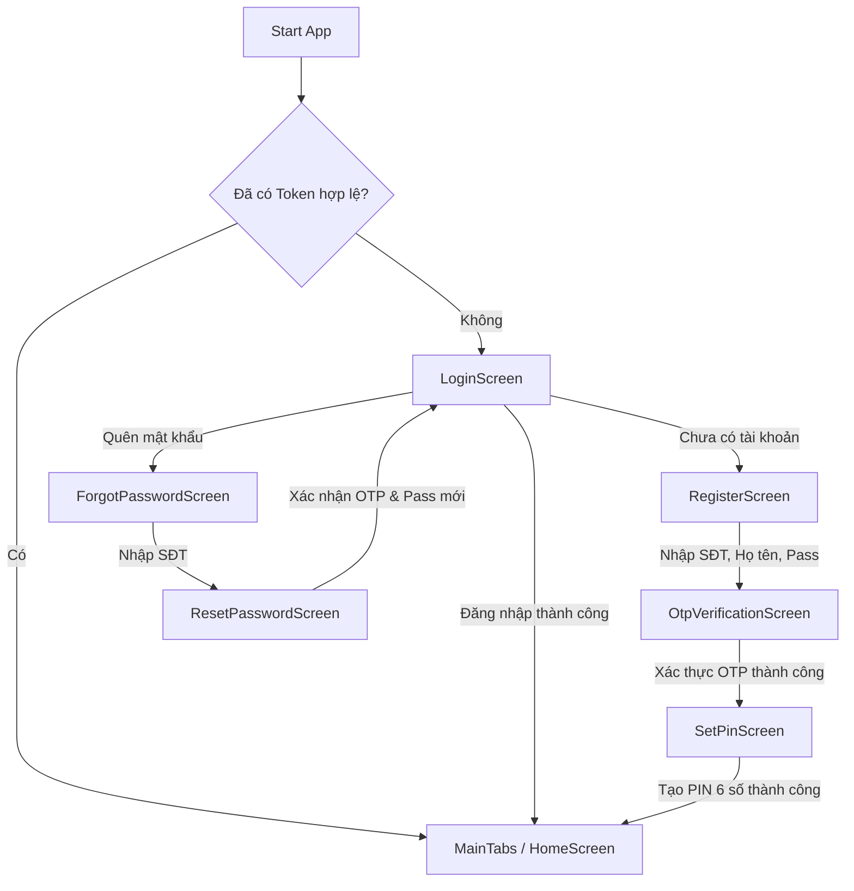
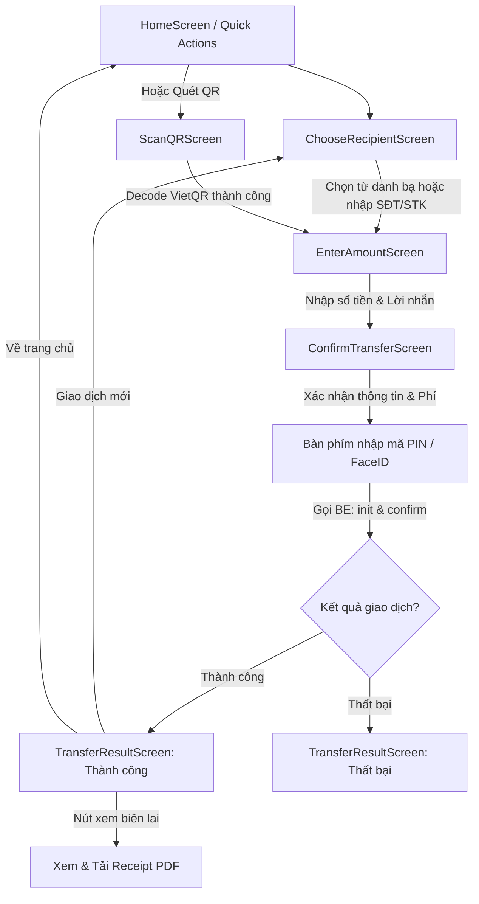
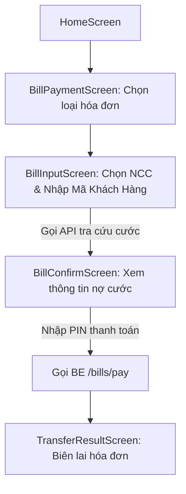

# 📱 TÀI LIỆU TỔNG QUAN HỆ THỐNG MÀN HÌNH, LUỒNG ĐIỀU HƯỚNG & API BACKEND

## Hướng Dẫn Chuyển Đổi Dự Án Từ React Native Sang Flutter (Fintech E-Wallet Sen Hồng)

> **Mục đích:** Tài liệu này cung cấp toàn bộ kiến trúc 50 màn hình, sơ đồ luồng người dùng (User Flows), bản đồ tích hợp API Backend (Spring Boot), và đề xuất kiến trúc Flutter (BLoC / Riverpod + GoRouter) để chuyển đổi trọn vẹn dự án.

---

## 📑 MỤC LỤC

1. [Tổng Quan Số Lượng Màn Hình (50 Màn Hình)](#1-tổng-quan-số-lượng-màn-hình-50-màn-hình)
2. [Phân Tích Chi Tiết Từng Module & Màn Hình](#2-phân-tích-chi-tiết-từng-module--màn-hình)
3. [Sơ Đồ Luồng Điều Hướng Chính (User Flows - Mermaid)](#3-sơ-đồ-luồng-điều-hướng-chính-user-flows)
4. [Bản Đồ Tích Hợp API Backend Chi Tiết Theo Từng Màn Hình](#4-bản-đồ-tích-hợp-api-backend-chi-tiết)
5. [Cơ Chế Realtime WebSocket & Thông Báo Đẩy (FCM)](#5-cơ-chế-realtime-websocket--thông-báo-đẩy-fcm)
6. [Đề Xuất Kiến Trúc & Thư Viện Tương Đương Khi Sang Flutter](#6-đề-xuất-kiến-trúc--thư-viện-khi-sang-flutter)
7. [📎 Phụ Lục: Hiệu Ứng Liquid Glass Nâng Cao Cho Card & BottomBar (Flutter)](#-phụ-lục-hiệu-ứng-liquid-glass-nâng-cao-cho-card--bottombar-flutter)

---

## 1. TỔNG QUAN SỐ LƯỢNG MÀN HÌNH (50 MÀN HÌNH)

Dự án gồm đúng **50 file màn hình (`.tsx`)**, 1 Container Bottom Tabs (`MainTabs.tsx`) và 1 Menu trượt (`SideMenuDrawer.tsx`), chia làm **10 phân hệ nghiệp vụ**:

| Phân Hệ (Module)                              | Số Màn Hình | Danh Sách Màn Hình                                                                                                                                        |
| ----------------------------------------------- | :------------: | ------------------------------------------------------------------------------------------------------------------------------------------------------------ |
| **1. Auth & Onboarding**                  |       8       | `Login`, `Register`, `OtpVerification`, `SetPin`, `ForgotPin`, `ForgotPassword`, `ResetPassword`, `TermsOfService`                           |
| **2. Core Shell & Main Tabs**             |       5       | `MainTabs` (chứa `HomeTab`, `Card`, `QR`, `Gift`, `Menu`), `SideMenuDrawer`                                                                   |
| **3. Chuyển Tiền & QR Flow**            |       8       | `ChooseRecipient` (`Transfer`), `EnterAmount`, `ConfirmTransfer`, `TransferConfirm`, `TransferResult`, `ScanQR`, `QRMy`, `RequestTransfer` |
| **4. Nạp & Rút Tiền**                  |       4       | `Deposit`, `DepositConfirm`, `Withdraw`, `WithdrawConfirm`                                                                                           |
| **5. Lịch Sử & Biên Lai**              |       2       | `TransactionHistory`, `TransactionDetail`                                                                                                                |
| **6. Hóa Đơn & Tiện Ích**            |       7       | `BillPayment`, `BillInput`, `BillConfirm`, `PhoneRecharge`, `Lottery`, `Savings`, `QuickLoan`                                                  |
| **7. Thẻ & Nguồn Tiền & Thụ Hưởng** |       3       | `CardsScreen`, `BankCardsScreen`, `PaymentMethodsScreen`, `BeneficiariesScreen`                                                                      |
| **8. Hồ Sơ Cá Nhân & eKYC**           |       6       | `UserProfile`, `IdentityDocument`, `KycLevel`, `EKyc`, `DigitalSignature`, `EmailSettings`                                                       |
| **9. Cài Đặt, Bảo Mật & Thiết Bị** |       4       | `SecuritySettings`, `DeviceManagement`, `Settings`, `Config`                                                                                         |
| **10. Thông Báo & Trợ Giúp**          |       4       | `Notifications`, `HelpCenter` (kèm `LiveChat`), `Search`, `Referral`                                                                              |

---

## 2. PHÂN TÍCH CHI TIẾT TỪNG MODULE & MÀN HÌNH

### Phân hệ 1: Xác thực & Khởi tạo (Authentication)

1. **`LoginScreen.tsx` (Route: `Login`)**:
   - Nhập SĐT + Mật khẩu. Hỗ trợ FaceID / Vân tay nếu đã kích hoạt sinh trắc học.
   - Nhớ thông tin đăng nhập, tra cứu tên masked name của user khi đổi số.
   - Tùy chọn đổi ảnh nền tùy chỉnh cá nhân hóa.
2. **`RegisterScreen.tsx` (Route: `Register`)**:
   - Nhập SĐT, Họ và tên, Mật khẩu mới (tối thiểu 6 ký tự), đồng ý Điều khoản.
3. **`OtpVerificationScreen.tsx` (Route: `OtpVerification`)**:
   - Nhập mã xác nhận OTP 6 số (gửi qua SMS/Backend log), có đếm ngược 60 giây và nút Gửi lại.
4. **`SetPinScreen.tsx` (Route: `SetPin`)**:
   - Bàn phím số riêng biệt nhập mã PIN 6 số dùng để ký chuyển tiền/rút tiền, bước xác nhận lại PIN (Confirm PIN).
5. **`ForgotPinScreen.tsx` (Route: `ForgotPin`)**:
   - Quên mã PIN, xác minh danh tính qua OTP để cấp quyền đặt lại mã PIN.
6. **`ForgotPasswordScreen.tsx` (Route: `ForgotPassword`)**:
   - Quên mật khẩu đăng nhập, nhập SĐT để hệ thống gửi mã OTP xác minh.
7. **`ResetPasswordScreen.tsx` (Route: `ResetPassword`)**:
   - Nhập mã OTP + Mật khẩu mới + Nhập lại mật khẩu mới để đặt lại mật khẩu tài khoản.
8. **`TermsOfServiceScreen.tsx` (Route: `TermsOfService`)**:
   - Hiển thị văn bản điều khoản pháp lý, chính sách bảo vệ dữ liệu cá nhân, nút Đồng ý & Tiếp tục.

---

### Phân hệ 2: Khung giao diện chính (Main Shell & Bottom Tabs)

9. **`MainTabs.tsx` (Route: `MainTabs` / `Home`)**:
   - Bottom Tab bar hiệu ứng Glassmorphism nổi lơ lửng, gồm 5 tab:
     - **Tab 1: Trang chủ (`HomeScreen`)**
     - **Tab 2: Thẻ (`CardsScreen`)**
     - **Tab 3: Quét QR (`ScanQRScreen`)**
     - **Tab 4: Ưu đãi (`PromotionsScreen`)**
     - **Tab 5: Tiện ích / Menu (`MoreScreen`)**
   - Lắng nghe sự kiện mở `SideMenuDrawer` từ Header.
10. **`HomeScreen.tsx`**:
    - **Header:** Avatar người dùng (click mở Menu trượt), Lời chào + Tên, Nút Tìm kiếm, Nút Chuông thông báo (kèm số thông báo chưa đọc).
    - **Thẻ số dư (Balance Card):** Số dư tài khoản chính, nút bật/tắt hiển thị số tiền (ẩn số dư bằng `******`), 4 nút hành động nhanh: Nạp tiền, Rút tiền, Chuyển tiền, Mã QR.
    - **Grid dịch vụ (Quick Services):** Chuyển tiền nội bộ/ngoài, Nạp ĐT, Điện nước, Tiết kiệm, Vay nhanh, Vietlott, Quản lý thẻ.
    - **Lịch sử gần đây (Recent Transactions):** Preview 3-5 giao dịch gần nhất, click chuyển sang chi tiết hoặc xem tất cả.
    - **Banner Quảng cáo & Khuyến mãi:** Carousel banner động.
11. **`CardsScreen.tsx` (Route tab: `Card`)**:
    - Mô phỏng thẻ Visa/Mastercard hoặc Thẻ ATM ảo Sen Hồng với chip EMV, số thẻ bị che, ngày hết hạn.
    - Chức năng: Khóa thẻ tạm thời, Mở khóa thẻ, Đổi mã PIN thẻ, Xem thông tin thẻ.
12. **`PromotionsScreen.tsx` (Route tab: `Gift` / `Promotions`)**:
    - Danh sách Voucher khuyến mãi phân theo tab: Tất cả, Nạp tiền, Hóa đơn, Mua sắm.
    - Ô nhập mã Voucher nhận quà, nút "Sao chép mã" hoặc "Dùng ngay".
13. **`MoreScreen.tsx` (Route tab: `Menu`)**:
    - Menu trung tâm mở rộng: Hồ sơ cá nhân, Nguồn tiền, Cài đặt bảo mật, Quản lý thiết bị, Giới thiệu bạn bè, Điều khoản, Hỗ trợ, Nút Đăng xuất.

---

### Phân hệ 3: Luồng Chuyển tiền & Quét QR (Transfer & QR Flow)

14. **`ChooseRecipientScreen.tsx` (Route: `Transfer`)**:
    - Chuyển tiền nội bộ (qua Số điện thoại / Wallet ID) hoặc Chuyển liên ngân hàng (VietQR / NAPAS 24/7).
    - Tra cứu tên người nhận tự động (Masked Name) khi gõ đủ SĐT hoặc STK.
    - Danh sách người thụ hưởng gần đây và đã lưu danh bạ.
15. **`EnterAmountScreen.tsx` (Route: `EnterAmount`)**:
    - Hiển thị người nhận, số dư khả dụng của ví nguồn.
    - Bàn phím số nhập tiền, các nút gợi ý tiền nhanh (+50k, +100k, +500k, +1tr, +2tr, Tất cả).
    - Nhập nội dung chuyển tiền (lời nhắn), tính phí ước tính tự động.
16. **`ConfirmTransferScreen.tsx` (Route: `ConfirmTransfer`)**:
    - Bảng tổng hợp giao dịch: Người nhận, Ngân hàng, Số tiền, Phí (0đ nếu nội bộ), Tổng trừ, Nội dung.
    - Tích chọn "Lưu người thụ hưởng".
    - Popup / Bàn phím nhập mã PIN bảo mật 6 số hoặc quét sinh trắc học FaceID/Vân tay để ký giao dịch.
17. **`TransferConfirmScreen.tsx` (Route: `TransferConfirm`)**:
    - Component phụ xác thực bổ sung OTP (khi hệ thống yêu cầu xác thực 2 lớp giao dịch giá trị cao).
18. **`TransferResultScreen.tsx` (Route: `TransferResult`)**:
    - Hiển thị Trạng thái giao dịch: Thành công (màu xanh lá) / Thất bại / Đang xử lý.
    - Mã giao dịch (Transaction ID), Thời gian giao dịch, Số dư mới cập nhật.
    - Các nút chức năng: Tải biên lai PDF, Chia sẻ ảnh chụp màn hình, Thực hiện giao dịch mới, Về trang chủ.
19. **`ScanQRScreen.tsx` (Route: `ScanQR` / tab `QR`)**:
    - Giao diện Camera quét chuẩn VietQR hoặc QR ví Sen Hồng, bật/tắt đèn Flash, chọn ảnh từ Gallery.
    - Tự động giải mã VietQR chuẩn EMVCo -> bóc tách STK, Mã ngân hàng (BIN), Số tiền, Nội dung -> chuyển thẳng sang màn hình xác nhận.
20. **`QRMyScreen.tsx` (Route: `MyQR`)**:
    - Tạo mã VietQR động cá nhân của chủ ví.
    - Tùy chọn nhập số tiền cần nhận trước khi tạo QR, tải ảnh QR về thư viện máy.
21. **`RequestTransferScreen.tsx` (Route: `RequestTransfer`)**:
    - Tạo yêu cầu chuyển tiền (Nhắc nợ / Đòi tiền / Chia tiền nhóm), chọn người trả và nhập số tiền cần nhận.

---

### Phân hệ 4: Luồng Nạp & Rút tiền (Deposit & Withdraw Flow)

22. **`DepositScreen.tsx` (Route: `Deposit`)**:
    - Nhập số tiền nạp vào ví, chọn nguồn nạp: Thẻ ngân hàng liên kết, Thẻ quốc tế Visa/Master, hoặc Chuyển khoản định danh.
23. **`DepositConfirmScreen.tsx` (Route: `DepositConfirm`)**:
    - Xác nhận nguồn nạp, số tiền, phí (miễn phí), nhập PIN xác thực. Chuyển sang màn kết quả nạp tiền.
24. **`WithdrawScreen.tsx` (Route: `Withdraw`)**:
    - Nhập số tiền rút về tài khoản ngân hàng, chọn tài khoản thụ hưởng từ danh sách ngân hàng đã liên kết.
25. **`WithdrawConfirmScreen.tsx` (Route: `WithdrawConfirm`)**:
    - Kiểm tra số dư ví, hạn mức ngày, nhập PIN để lấy `pinToken` từ BE, sau đó gọi lệnh rút tiền bảo mật.

---

### Phân hệ 5: Lịch sử & Báo cáo sao kê (History & Statement)

26. **`TransactionHistoryScreen.tsx` (Route: `TransactionHistory`)**:
    - Danh sách phân trang mọi giao dịch: Lọc theo loại (Tất cả, Chuyển tiền, Nạp tiền, Rút tiền, Hóa đơn).
    - Bộ lọc thời gian (Hôm nay, Tuần này, Tháng này, hoặc tùy chọn từ ngày - đến ngày).
    - Nút Xuất sao kê: Tải file Excel, CSV, hoặc PDF.
27. **`TransactionDetailScreen.tsx` (Route: `TransactionDetail`)**:
    - Chi tiết toàn bộ thông tin 1 giao dịch. Nút "Tải hóa đơn điện tử / Biên lai PDF" (`receipt.pdf`).
    - Nút "Chuyển lại" (thực hiện lại giao dịch tới người nhận này).

---

### Phân hệ 6: Hóa đơn & Tiện ích tài chính (Bills & Financial Services)

28. **`BillPaymentScreen.tsx` (Route: `BillPayment`)**:
    - Lưới danh mục: Điện lực, Nước sinh hoạt, Internet / Truyền hình cáp, Nạp thẻ ĐT, Học phí, Viện phí, Chung cư.
29. **`BillInputScreen.tsx` (Route: `BillInput`)**:
    - Chọn đơn vị cung cấp dịch vụ (ví dụ: Điện lực EVN Hà Nội, EVN Miền Nam, Nước Chợ Lớn...).
    - Nhập Mã khách hàng / Mã danh bộ. Bấm "Tra cứu cước".
30. **`BillConfirmScreen.tsx` (Route: `BillConfirm`)**:
    - Hiển thị thông tin cước: Tên chủ hộ, Địa chỉ, Kỳ hóa đơn, Số tiền nợ cước. Xác nhận thanh toán qua ví.
31. **`PhoneRechargeScreen.tsx` (Route: `PhoneRecharge`)**:
    - Nạp tiền điện thoại trực tiếp hoặc Mua thẻ cào điện tử.
    - Chọn nhà mạng (Viettel, Vina, Mobi, Vietnamobile, Wintel) và mệnh giá (10k, 20k, 50k, 100k, 200k, 500k).
32. **`LotteryScreen.tsx` (Route: `Lottery`)**:
    - Mua vé số Vietlott trực tuyến (Mega 6/45, Power 6/55, Keno), tự chọn số hoặc chọn ngẫu nhiên, thanh toán qua ví.
33. **`SavingsScreen.tsx` (Route: `Savings`)**:
    - Mở tài khoản tiết kiệm online: Bảng lãi suất theo kỳ hạn (1, 3, 6, 12 tháng), công cụ tính lãi dự kiến khi đáo hạn, quản lý các sổ tiết kiệm đang có.
34. **`QuickLoanScreen.tsx` (Route: `QuickLoan`)**:
    - Đăng ký vay tiêu dùng nhanh: Nhập số tiền vay, kỳ hạn trả góp, xem lịch trả nợ gốc + lãi hàng tháng, gửi hồ sơ vay online.

---

### Phân hệ 7: Quản lý Thẻ, Nguồn tiền & Danh bạ thụ hưởng

35. **`PaymentMethodsScreen.tsx` (Route: `PaymentMethods`)**:
    - Quản lý danh sách phương thức thanh toán: Ví chính, Thẻ quốc tế Visa/Mastercard/JCB.
    - Form thêm thẻ mới (nhập số thẻ, tên chủ thẻ, ngày hết hạn, mã CVV) - mã hóa an toàn.
36. **`BankCardsScreen.tsx` (Route: `BankCards` / `BankCardManagement`)**:
    - Quản lý các tài khoản ngân hàng nội địa liên kết: Thêm tài khoản ngân hàng, Hủy liên kết, Đặt làm tài khoản nhận tiền mặc định.
37. **`BeneficiariesScreen.tsx` (Route: `Beneficiaries`)**:
    - Danh bạ thụ hưởng: Tìm kiếm theo tên/SĐT, sửa biệt danh (nickname), xóa người thụ hưởng, click để chuyển tiền nhanh.

---

### Phân hệ 8: Hồ sơ cá nhân & Định danh điện tử (eKYC)

38. **`UserProfileScreen.tsx` (Route: `UserProfile`)**:
    - Xem và chỉnh sửa thông tin cá nhân: Họ tên, Email, Ngày sinh, Tình trạng xác thực danh tính. Đổi ảnh đại diện (Avatar).
39. **`IdentityDocumentScreen.tsx` (Route: `IdentityDocument`)**:
    - Xem thông tin CCCD / Hộ chiếu đã được định danh, trạng thái phê duyệt (Đã duyệt / Chờ duyệt / Bị từ chối).
40. **`KycLevelScreen.tsx` (Route: `KycLevel`)**:
    - Xem hạn mức giao dịch theo cấp độ định danh:
      - Cấp 1 (Chưa định danh): Hạn mức tối đa 5.000.000đ/ngày.
      - Cấp 2 (Đã KYC CCCD): Hạn mức 100.000.000đ/ngày.
      - Cấp 3 (Nâng cao): Hạn mức 500.000.000đ/ngày.
41. **`EKycScreen.tsx` (Route: `EKyc`)**:
    - Quy trình xác thực định danh tự động bằng Camera: Chụp mặt trước CCCD -> Chụp mặt sau CCCD -> Chụp ảnh chân dung (Face Liveness).
42. **`DigitalSignatureScreen.tsx` (Route: `DigitalSignature`)**:
    - Quản lý chữ ký số cá nhân (Smart OTP / Chứng thư số bảo mật PKI) dùng cho các giao dịch hạn mức lớn.
43. **`EmailSettingsScreen.tsx` (Route: `EmailSettings`)**:
    - Cài đặt và xác thực email nhận hóa đơn điện tử VAT và thông báo sao kê định kỳ.

---

### Phân hệ 9: Cài đặt, Bảo mật & Quản lý thiết bị

44. **`SecuritySettingsScreen.tsx` (Route: `SecuritySettings`)**:
    - Trung tâm bảo mật: Đổi mật khẩu, Đổi mã PIN giao dịch, Bật/tắt sinh trắc học (Biometrics Login), Cài đặt 2FA.
45. **`DeviceManagementScreen.tsx` (Route: `DeviceManagement`)**:
    - Danh sách các thiết bị đang đăng nhập tài khoản (Model máy, Địa chỉ IP, Thời gian hoạt động gần nhất).
    - Nút Đăng xuất từ xa từng thiết bị lạ hoặc Đăng xuất tất cả thiết bị khác.
46. **`SettingsScreen.tsx` (Route: `Settings`)**:
    - Tùy chọn giao diện: Chế độ Sáng / Tối (Light/Dark Mode), Chọn hình nền app cá nhân hóa, Cài đặt ngôn ngữ.
47. **`ConfigScreen.tsx` (Route: `Config`)**:
    - Màn hình cấu hình URL Backend API (`API_BASE_URL`) cho môi trường dev/staging/production.

---

### Phân hệ 10: Thông báo, Hỗ trợ & Giới thiệu

48. **`NotificationsScreen.tsx` (Route: `Notifications`)**:
    - Danh sách thông báo chia 3 tab: **Biến động số dư**, **Khuyến mãi**, **Hệ thống**.
    - Đánh dấu đã đọc từng thông báo hoặc Đánh dấu đọc tất cả. Click thông báo biến động số dư chuyển ngay tới chi tiết giao dịch.
49. **`HelpCenterScreen.tsx` (Route: `HelpCenter` / `LiveChat`)**:
    - Tra cứu câu hỏi thường gặp (FAQ), Gửi phiếu khiếu nại/yêu cầu trợ giúp (Ticket), và Chat trực tuyến với hỗ trợ viên (Live Chat).
50. **`SearchScreen.tsx` (Route: `Search`)**:
    - Thanh tìm kiếm toàn cục: Tìm kiếm nhanh chức năng, người thụ hưởng, hóa đơn cước, hoặc mã khuyến mãi.
51. **`ReferralScreen.tsx` (Route: `Referral`)**:
    - Giới thiệu bạn bè: Mã mời cá nhân, link chia sẻ qua Zalo/Facebook/SMS, danh sách bạn bè đã tham gia và điểm thưởng tích lũy.

---

## 3. SƠ ĐỒ LUỒNG ĐIỀU HƯỚNG CHÍNH (USER FLOWS)

### Sơ đồ 1: Luồng Đăng nhập, Đăng ký & Onboarding



---

### Sơ đồ 2: Luồng Chuyển tiền nội bộ & liên ngân hàng (Transfer Flow)



---

### Sơ đồ 3: Luồng Nạp & Rút tiền (Deposit & Withdraw Flow)

```mermaid
flowchart TD
    Home[HomeScreen] -->|Nạp tiền| Dep[DepositScreen]
    Dep -->|Nhập số tiền & chọn nguồn| DepConf[DepositConfirmScreen]
    DepConf -->|Xác thực PIN| DepRes[TransferResultScreen]
  
    Home -->|Rút tiền| Wd[WithdrawScreen]
    Wd -->|Nhập tiền & chọn Ngân hàng nhận| WdConf[WithdrawConfirmScreen]
    WdConf -->|Nhập PIN verify lấy pinToken| WdExec[Gọi BE /wallets/withdraw]
    WdExec --> WdRes[TransferResultScreen]
```



---

### Sơ đồ 4: Luồng Thanh toán hóa đơn (Bill Payment Flow)



---

## 4. BẢN ĐỒ TÍCH HỢP API BACKEND CHI TIẾT

> **Base URL:** `http://localhost:8080/api/v1` (hoặc cấu hình tùy ý)
> **Auth Header:** `Authorization: Bearer {accessToken}`
> **Idempotency:** Bắt buộc Header `Idempotency-Key: {UUID}` đối với mọi request thay đổi số dư (`POST deposit`, `POST transfer`, `POST withdraw`, `POST pay`).

| Màn Hình                   | Hành Động Trên Giao Diện      | HTTP Method & Path                      | Body / Query Params                                                               | Response Chính                                                             |
| ---------------------------- | ---------------------------------- | --------------------------------------- | --------------------------------------------------------------------------------- | --------------------------------------------------------------------------- |
| **LoginScreen**        | Đăng nhập tài khoản           | `POST /auth/login`                    | `{phoneNumber, password}`                                                       | `AuthResponse` (`accessToken`, `refreshToken`, `userId`)            |
| **LoginScreen**        | Đăng nhập vân tay/FaceID       | `POST /security/biometric/verify`     | `?biometricToken=`                                                              | `pinToken`                                                                |
| **RegisterScreen**     | Đăng ký tài khoản             | `POST /auth/register`                 | `{phoneNumber, password, fullName}`                                             | `AuthResponse` (201 Created)                                              |
| **OtpVerification**    | Xác thực OTP 6 số               | `POST /auth/otp/verify`               | `?phoneNumber=&otp=`                                                            | `Boolean` (true/false)                                                    |
| **OtpVerification**    | Gửi lại mã OTP                  | `POST /auth/otp/send`                 | `?phoneNumber=`                                                                 | `null`                                                                    |
| **ForgotPassword**     | Gửi yêu cầu quên MK            | `POST /auth/forgot-password`          | `?phoneNumber=`                                                                 | `null`                                                                    |
| **ResetPassword**      | Đặt lại mật khẩu mới         | `POST /auth/reset-password`           | `?phoneNumber=&otp=&newPassword=`                                               | `null`                                                                    |
| **SetPinScreen**       | Tạo mã PIN 6 số                 | `POST /users/pin/set`                 | `{pin}`                                                                         | `null`                                                                    |
| **HomeScreen**         | Lấy số dư ví                   | `GET /wallets/{walletId}`             | —                                                                                | `WalletResponse` (`balance`, `currency`)                              |
| **HomeScreen**         | Lấy 5 GD gần nhất               | `GET /transactions`                   | `?walletId=&page=0&size=5`                                                      | `List<TransferResponse>`                                                  |
| **HomeScreen**         | Đếm thông báo mới             | `GET /notifications`                  | `?page=0&size=10`                                                               | `PageResponse<NotificationInfo>`                                          |
| **ChooseRecipient**    | Tra cứu tên người nhận        | `GET /wallets/recipient-info`         | `?phoneNumber=` hoặc `?walletId=`                                            | `RecipientInfoResponse` (`maskedName`, `fullName`)                    |
| **ChooseRecipient**    | Lấy danh bạ thụ hưởng         | `GET /beneficiaries`                  | —                                                                                | `List<Beneficiary>`                                                       |
| **ChooseRecipient**    | Lấy danh sách ngân hàng        | `GET /banks`                          | —                                                                                | `List<BankResponse>` (VCB, TCB, BIDV, SENHONG...)                         |
| **EnterAmount**        | Dự toán phí chuyển tiền       | `GET /wallets/fees/estimate`          | `?type=TRANSFER&amount=&currency=VND`                                           | `FeeEstimateResponse` (`feeAmount`)                                     |
| **ConfirmTransfer**    | Khởi tạo giao dịch (Bước 1)   | `POST /wallets/transfer/init`         | `{requestId, sourceWalletId, targetWalletId, amount, currency, bankCode, note}` | `TransferResponse` (`status: PENDING_CONFIRMATION`, `transactionId`)  |
| **ConfirmTransfer**    | Ký PIN hoàn tất (Bước 2)      | `POST /wallets/transfer/{id}/confirm` | `?pin=` hoặc `?otp=`                                                         | `TransferResponse` (`status: SUCCESS`, `newBalance`)                  |
| **ConfirmTransfer**    | Lưu thụ hưởng mới             | `POST /beneficiaries`                 | `{beneficiaryWalletId, nickname, bankCode, accountNumber}`                      | `Beneficiary`                                                             |
| **TransferResult**     | Tải biên lai PDF                 | `GET /transactions/{id}/receipt.pdf`  | —                                                                                | `byte[]` (`application/pdf`)                                            |
| **ScanQRScreen**       | Giải mã chuỗi VietQR            | `POST /payments/vietqr/decode`        | `?qrString=`                                                                    | `VietQrPayload` (`bankBin`, `accountNumber`, `amount`, `purpose`) |
| **QRMyScreen**         | Lấy mã VietQR của tôi          | `GET /users/me/qrcode`                | —                                                                                | String VietQR / EMVCo                                                       |
| **QRMyScreen**         | Sinh mã QR có chỉ định tiền  | `POST /payments/vietqr/generate`      | `{bankBin, accountNumber, amount, purpose}`                                     | `VietQrPayload`                                                           |
| **DepositConfirm**     | Nạp tiền vào ví                | `POST /wallets/deposit`               | `{requestId, walletId, amount, currency}`                                       | `TransferResponse`                                                        |
| **WithdrawConfirm**    | Xác minh PIN lấy token           | `POST /users/pin/verify`              | `{pin}`                                                                         | `pinToken` (String)                                                       |
| **WithdrawConfirm**    | Rút tiền về ngân hàng         | `POST /wallets/withdraw`              | `{requestId, walletId, bankAccountId, amount, currency, pinToken}`              | `TransferResponse`                                                        |
| **TransactionHistory** | Xem danh sách GD có phân trang  | `GET /transactions`                   | `?walletId=&type=&page=0&size=20`                                               | `List<TransferResponse>`                                                  |
| **TransactionHistory** | Xuất file sao kê                 | `GET /transactions/export/{format}`   | `?walletId=&fromDate=&toDate=` (format: csv/pdf/excel)                          | File download stream                                                        |
| **TransactionDetail**  | Chi tiết 1 giao dịch             | `GET /transactions/{id}`              | —                                                                                | `TransferResponse`                                                        |
| **BillInputScreen**    | Tra cứu hóa đơn nợ cước     | `GET /bills/lookup`                   | `?type={ELECTRICITY/WATER...}&customerCode=`                                    | `Bill` (`billId`, `customerName`, `amount`, `period`)             |
| **BillConfirmScreen**  | Thanh toán tiền hóa đơn       | `POST /bills/pay`                     | `{requestId, walletId, billId, amount, currency}`                               | `TransferResponse`                                                        |
| **PhoneRecharge**      | Nạp tiền ĐT / Mua mã thẻ      | `POST /bills/topup`                   | `{requestId, walletId, phoneNumber, amount, currency}`                          | `TransferResponse`                                                        |
| **PaymentMethods**     | Xem danh sách nguồn tiền        | `GET /funding-sources`                | —                                                                                | `List<FundingSourceResponse>`                                             |
| **PaymentMethods**     | Liên kết thẻ quốc tế mới     | `POST /funding-sources/link`          | `{type, provider, number, cardHolderName, expiryDate, cvv}`                     | `FundingSourceResponse`                                                   |
| **PaymentMethods**     | Hủy liên kết nguồn tiền       | `DELETE /funding-sources/{id}`        | —                                                                                | `null`                                                                    |
| **BankCardsScreen**    | Danh sách TK ngân hàng          | `GET /bank-accounts`                  | —                                                                                | `List<BankAccountResponse>`                                               |
| **BankCardsScreen**    | Liên kết ngân hàng mới        | `POST /bank-accounts/link`            | `{bankCode, accountNumber, accountHolderName}`                                  | `BankAccountResponse`                                                     |
| **UserProfileScreen**  | Xem hồ sơ cá nhân              | `GET /users/me`                       | —                                                                                | `UserProfile` (`userId`, `fullName`, `email`, `avatarUrl`)        |
| **UserProfileScreen**  | Cập nhật hồ sơ                 | `PUT /users/me`                       | `?fullName=&email=&dob=`                                                        | `UserProfile`                                                             |
| **UserProfileScreen**  | Đổi ảnh đại diện             | `POST /users/me/avatar`               | `?avatarUrl=`                                                                   | `UserProfile`                                                             |
| **EKycScreen**         | Gửi ảnh duyệt định danh       | `POST /users/kyc`                     | `{idCardNumber, fullName, dob, frontCardUrl, backCardUrl, selfieUrl}`           | `KycResponse`                                                             |
| **IdentityDocument**   | Kiểm tra trạng thái KYC         | `GET /users/kyc/status`               | —                                                                                | `KycResponse` (`status: PENDING/VERIFIED/REJECTED`)                     |
| **KycLevelScreen**     | Xem hạn mức chi tiêu            | `GET /config/limits/status`           | —                                                                                | `UserLimitStatus` (`dailyLimit`, `dailySpent`, `monthlyRemaining`)  |
| **DeviceManagement**   | Danh sách thiết bị đăng nhập | `GET /sessions`                       | —                                                                                | `List<DeviceSession>`                                                     |
| **DeviceManagement**   | Đăng xuất thiết bị từ xa     | `DELETE /sessions/{deviceId}`         | —                                                                                | `null`                                                                    |
| **Notifications**      | Xem danh sách thông báo         | `GET /notifications`                  | `?type=&page=0&size=20`                                                         | `PageResponse<NotificationInfo>`                                          |
| **Notifications**      | Đánh dấu đã đọc 1 tin       | `PATCH /notifications/{id}/read`      | —                                                                                | `null`                                                                    |
| **Notifications**      | Đánh dấu đọc tất cả         | `PATCH /notifications/read-all`       | `?type=`                                                                        | `null`                                                                    |
| **HelpCenterScreen**   | Lấy câu hỏi thường gặp FAQ   | `GET /support/faq`                    | —                                                                                | `List<{question, answer}>`                                                |
| **HelpCenterScreen**   | Tạo ticket hỗ trợ               | `POST /support/tickets`               | `?subject=&category=&initialMessage=`                                           | `SupportTicket`                                                           |
| **MoreScreen**         | Đăng xuất tài khoản           | `POST /auth/logout`                   | Header Authorization                                                              | `null`                                                                    |

---

## 5. CƠ CHẾ REALTIME WEBSOCKET & THÔNG BÁO ĐẨY (FCM)

### 1. WebSocket STOMP (Biến động số dư Realtime)

- **URL kết nối:** `ws://localhost:8080/ws-native` (native WebSocket không dùng SockJS)
- **Header xác thực khi CONNECT:** `Authorization: Bearer {accessToken}`
- **Destination Subscribe:** `/topic/users/{userId}/notifications`
- **Mẫu Payload nhận được khi có tiền vào/ra:**

```json
{
  "id": "uuid",
  "title": "Biến động số dư: +500,000 VND",
  "body": "Bạn vừa nhận được 500,000 VND từ NGUYEN VAN A. Nội dung: Chuyen tien",
  "type": "BALANCE",
  "data": {
    "transactionId": "uuid-123",
    "amount": 500000.0,
    "newBalance": 2000000.0
  }
}
```

*-> Khi nhận message: Cập nhật ngay `balance` trên App state và kích hoạt âm thanh / thông báo in-app.*

### 2. Quản lý Device Token (FCM Push Notifications)

- Sau khi đăng nhập: Lấy FCM Token từ thiết bị và gọi:
  `POST /api/v1/sessions/{deviceId}/fcm?fcmToken={token}`
- Khi đăng xuất: Gọi hủy đăng ký FCM để tránh nhận thông báo của tài khoản cũ.

---

## 6. ĐỀ XUẤT KIẾN TRÚC & THƯ VIỆN KHI SANG FLUTTER

### Bảng đối chiếu công nghệ (React Native ➔ Flutter):

| Thành Phần Nghiệp Vụ           | React Native Hiện Tại                                        | Thư Viện Tương Đương Flutter                          | Ghi Chú                                            |
| ---------------------------------- | -------------------------------------------------------------- | ------------------------------------------------------------ | --------------------------------------------------- |
| **Architecture**             | React Hooks + Context API                                      | **BLoC (flutter_bloc)** hoặc **Riverpod**       | Khuyên dùng BLoC cho Fintech vì tính chặt chẽ |
| **Navigation & Routing**     | `@react-navigation/stack`, `@react-navigation/bottom-tabs` | **`go_router`**                                      | Hỗ trợ Nested StatefulShellRoute cho MainTabs     |
| **HTTP Client**              | `fetch` + custom wrapper                                     | **`dio`** + `pretty_dio_logger`                    | Hỗ trợ Interceptor tự động refresh JWT token   |
| **Lưu trữ bảo mật**      | `expo-secure-store`                                          | **`flutter_secure_storage`**                         | Lưu AccessToken, RefreshToken, PIN token           |
| **WebSocket Realtime**       | Native WebSocket STOMP                                         | **`stomp_dart_client`**                              | Kết nối trực tiếp STOMP broker qua WebSocket    |
| **Quét mã QR**             | `expo-camera` / `react-native-camera`                      | **`mobile_scanner`**                                 | Quét QR cực nhanh, hỗ trợ cả Android & iOS     |
| **Tạo mã QR**              | `react-native-qrcode-svg`                                    | **`qr_flutter`**                                     | Sinh mã VietQR hiển thị cho khách quét         |
| **Sinh trắc học**          | `expo-local-authentication`                                  | **`local_auth`**                                     | Xác thực Vân tay / FaceID                        |
| **Xem File PDF**             | Webview / Expo FileSystem                                      | **`flutter_pdfview`** hoặc **`open_filex`** | Mở biên lai giao dịch ngân hàng PDF            |
| **Hiệu ứng Glassmorphism** | BlurView                                                       | **`BackdropFilter`**                                 | Widget có sẵn trong Flutter engine                |
| **Định dạng tiền tệ**   | Intl / Number format                                           | **`intl`**                                           | `NumberFormat.currency(locale: 'vi_VN')`          |

### Cấu trúc thư mục Flutter chuẩn (Clean Architecture):

```text
lib/
├── core/
│   ├── constants/        # API URLs, Bank Codes, Asset paths
│   ├── network/          # Dio client, AuthInterceptor, IdempotencyInterceptor
│   ├── theme/            # AppColors, AppTypography, Glassmorphism styles
│   └── utils/            # Formatters (VND currency, DateTime, Masked text)
├── data/
│   ├── datasources/      # Remote API & Local Secure Storage
│   ├── models/           # DTO Json Serializable (User, Wallet, Transaction...)
│   └── repositories/     # Repository implementations
├── domain/
│   ├── entities/         # Business entities
│   ├── repositories/     # Abstract repository interfaces
│   └── usecases/         # Auth, Transfer, BillPayment, Deposit usecases
├── presentation/
│   ├── blocs/            # AuthBloc, WalletBloc, TransferBloc, NotificationBloc
│   ├── screens/          # 50 màn hình chia theo 10 phân hệ như trên
│   │   ├── auth/
│   │   ├── home/
│   │   ├── transfer/
│   │   ├── deposit_withdraw/
│   │   ├── history/
│   │   ├── bills/
│   │   ├── cards/
│   │   ├── profile_ekyc/
│   │   ├── settings/
│   │   └── support/
│   └── widgets/          # Numpad PIN, GlassCard, CustomButton, BalanceBadge
└── main.dart             # Khởi tạo DI, WebSocket, Push Notifs, App Entry
```

---

# 📎 PHỤ LỤC: Hiệu Ứng Liquid Glass Nâng Cao Cho Card & BottomBar (Flutter)

> Bổ sung cho mục **6. Đề Xuất Kiến Trúc & Thư Viện Khi Sang Flutter** của tài liệu chính. Phần này đi sâu vào việc áp dụng hiệu ứng kính mờ (liquid glass) cho hai vị trí quan trọng nhất của app: **Balance Card / thẻ ngân hàng** và **thanh `MainTabs` phía dưới**.

---

## 0. Vì sao nên làm lại phần này khi sang Flutter

Ở bản React Native hiện tại, `MainTabs.tsx` đang dùng `expo-liquid-glass-native` — một **native module** (dựng trên Kyant Backdrop/Jetpack Compose ở tầng Kotlin) bọc qua `PlatformView`. Đây chính là lý do phát sinh bug **chạm xuyên (touch-through)** trên Android: sự kiện chạm phải đi qua ranh giới Native View ↔ RN Bridge, và lớp kính mờ native "che" mất hit-test của RN.

Ở Flutter, hai thư viện dưới đây (`liquid_glass_widgets`, `flutter_liquid_glass_plus`) **không dùng `PlatformView`** — toàn bộ hiệu ứng kính (blur + refraction) được vẽ bằng `BackdropFilter` + fragment shader ngay trong cây render của Flutter (Impeller/Skia). Điều đó có nghĩa là:

- Hit-testing chạm đi qua **cơ chế gesture arena chuẩn của Flutter**, không băng qua biên giới native view nào cả → **về mặt kiến trúc không còn tồn tại lớp gây ra bug chạm xuyên** như bên RN.
- Không cần `patch-package` để vá code Kotlin gốc nữa.

Đây là lý do phần này đáng để đưa vào tài liệu chuyển đổi: nó không chỉ là "làm đẹp thêm", mà còn **loại bỏ tận gốc lớp nguyên nhân gây bug** đã gặp ở dự án `nganhangfe`.

---

## 1. So sánh hai gói thư viện

| Tiêu chí | **`liquid_glass_widgets`** | **`liquid_glass_ui`** (⚠️ xem lưu ý mục 1.1) |
|---|---|---|
| Phiên bản mới nhất | **1.3.0** (phát hành trong ngày) | Có **nhầm lẫn tên gói** — xem bên dưới |
| Nhà phát hành | **Verified publisher**: `pixel-innovations.com` | Unverified uploader |
| Độ phủ component | ~50 widget: `GlassCard`, `GlassContainer`, `GlassScaffold`, `GlassAppBar`, `GlassTabBar` (`.bottom`/`.minimizable`/`.searchable`), `GlassButton`, `GlassSheet`, `GlassMenu`... | Tùy đúng gói bạn cài (xem 1.1) |
| Dependency ngoài | **0** — thuần Flutter SDK, tự vendor shader | `flutter` only (gói nhỏ) hoặc phụ thuộc `liquid_glass_renderer` (gói lớn hơn) |
| Cơ chế hiệu năng | 3 **Quality Mode**: `minimal` (BackdropFilter thuần, 0 chi phí shader) / `standard` / `premium` (shader đầy đủ, chỉ dùng cho bề mặt tĩnh) + `GlassAdaptiveScope` tự benchmark thiết bị | Không có cơ chế quality-tier tương đương ở bản cơ bản |
| Card | `GlassCard` (padding 16px mặc định, `avoidsRefraction` để không "vỡ" kính khi lồng nhau) | `LiquidGlassContainer` / `LGCard` tùy gói |
| Bottom bar | `GlassTabBar.bottom` — có `minimizable`, `contentAwareBrightness` (tự đổi icon sáng/tối theo nội dung cuộn phía sau), `GlassScaffold` tự động promote bar lên quality `premium` | Roadmap ghi "Coming Soon" ở bản 0.0.1 gốc; bản mở rộng có `LGBottomBar`/`LiquidGlassBottomNavigationBar` tùy gói |

**Khuyến nghị:** dùng **`liquid_glass_widgets`** làm lựa chọn chính cho `GlassCard` (Balance Card, thẻ ATM/Visa) và `GlassTabBar.bottom` (thay `MainTabs`), vì đây đúng là gói *"mới, chất lượng cao, có fallback hiệu năng"* mà bạn nhắc tới — 3 tầng quality + adaptive benchmark chính là cơ chế fallback đó.

### 1.1. ⚠️ Lưu ý quan trọng: nhầm lẫn tên gói `liquid_glass_ui`

Khi tra trên pub.dev, tên `liquid_glass_ui` **trỏ tới ít nhất hai gói khác nhau về nội dung nhưng dùng chung class `LiquidGlassContainer`**:

1. **`liquid_glass_ui` (chính chủ, v0.4.0, publisher `prdalai`)** — rất tối giản, mới chỉ có `LiquidGlassContainer`, roadmap còn ghi "Coming Soon" cho `LiquidGlassButton`/`LiquidGlassBottomSheet`. **Đây không phải** là gói "nhiều component dựng sẵn".
2. **`liquid_glass_ui_design` (v1.0.5)** — import bằng `package:liquid_glass_ui_design/liquid_glass_ui.dart`, quảng cáo **52 component dựng sẵn** (button, tab, navigation bar, card, picker, dialog...). Đây mới khớp với mô tả *"nhiều component dựng sẵn"* — nhưng **tên package thật trên `pubspec.yaml` là `liquid_glass_ui_design`, không phải `liquid_glass_ui`**.
3. Ngoài ra còn có `flutter_liquid_glass_plus` (`LGCard`, `LGBottomBar`, `LGSwitch`...) và `liquid_glass_texture` (`LiquidGlassCard`, `LiquidGlassBottomNavigationBar`) — cùng chủ đề, khác tên, khác tác giả.

👉 **Với một app fintech**, trước khi thêm bất kỳ gói nào trong nhóm "nhiều component" này vào `pubspec.yaml`, hãy tự kiểm tra kỹ trên pub.dev: tên chính xác, publisher, số lượt tải, ngày cập nhật gần nhất — vì phần lớn các gói cùng chủ đề "Liquid Glass" hiện đang là **unverified uploader**, pub points/health thấp hơn nhiều so với `liquid_glass_widgets`. Nên coi các gói này là **lựa chọn phụ để tham khảo UI mẫu**, còn phần Card/BottomBar chính thức của Sen Hồng nên dựng trên `liquid_glass_widgets`.

---

## 2. Cài đặt & khởi tạo (`liquid_glass_widgets`)

```yaml
# pubspec.yaml
dependencies:
  liquid_glass_widgets: ^1.3.0
  cupertino_icons: ^1.0.8   # bắt buộc — widget kính dùng icon CupertinoIcons
```

```dart
// main.dart
void main() async {
  WidgetsFlutterBinding.ensureInitialized();
  await LiquidGlassWidgets.initialize(); // pre-warm shader, tránh "nháy trắng" lần đầu

  runApp(LiquidGlassWidgets.wrap(
    child: const SenHongApp(),
    brightnessResolver: Theme.maybeBrightnessOf, // bắt buộc nếu dùng MaterialApp
    adaptiveQuality: true, // tự benchmark thiết bị, hạ quality khi máy yếu/nóng
    theme: GlassThemeData.simple(
      blur: 10,
      thickness: 30,
      quality: GlassQuality.standard,
    ),
  ));
}
```

> Vì `liquid_glass_widgets` không cấp `Material` ancestor, nếu app dùng `MaterialApp` cần thêm:
> ```dart
> MaterialApp(
>   builder: (context, child) => Material(type: MaterialType.transparency, child: child!),
>   home: const MyHomePage(),
> )
> ```

---

## 3. Áp dụng cho Card (Balance Card / CardsScreen)

Theo nguyên tắc thiết kế của thư viện: **"Glass is a Platter, not a Wrapper"** — kính dùng cho *bề mặt điều hướng/nổi* (navigation, floating), còn nội dung cuộn (list, feed) nên giữ opaque để tiết kiệm hiệu năng. Áp vào các màn hình hiện có:

| Màn hình / thành phần | Loại bề mặt | Quality khuyến nghị | Lý do |
|---|---|---|---|
| **HomeScreen** — Thẻ số dư (Balance Card) | Tĩnh, không cuộn | `GlassQuality.premium` | Bề mặt trọng tâm, đứng yên trong khung nhìn → dùng shader đầy đủ (refraction, chromatic aberration) không lo tốn GPU khi cuộn |
| **CardsScreen** — mô phỏng thẻ Visa/Mastercard/ATM ảo | Tĩnh (carousel dừng lại từng thẻ) | `GlassQuality.premium` | Giống hero section — mục đích chính là hiệu ứng thị giác |
| **TransactionHistoryScreen** — danh sách 20+ giao dịch/trang | Cuộn liên tục | `GlassQuality.minimal` | Danh sách dài đang cuộn: `minimal` dùng `BackdropFilter` thuần, **0 lần gọi shader tùy biến** khi cuộn, tránh giật khung hình |
| **BeneficiariesScreen**, **PaymentMethodsScreen** — card danh sách | Cuộn | `GlassQuality.minimal` hoặc bỏ kính, dùng `CupertinoListTile`/container thường | Theo đúng bảng "Use glass for / Keep opaque" của thư viện — list cell nên opaque |

Ví dụ code cho **Balance Card**:

```dart
GlassCard(
  quality: GlassQuality.premium,
  settings: LiquidGlassSettings(
    specularSharpness: GlassSpecularSharpness.medium, // mặc định, khớp chuẩn iOS 26
  ),
  child: Padding(
    padding: const EdgeInsets.all(20),
    child: Column(
      crossAxisAlignment: CrossAxisAlignment.start,
      children: [
        Text('Số dư khả dụng', style: subtitleStyle),
        Text(hideBalance ? '******' : formattedBalance, style: balanceStyle),
        const SizedBox(height: 16),
        Row(children: quickActionButtons), // Nạp / Rút / Chuyển / QR
      ],
    ),
  ),
)
```

Ví dụ cho **danh sách giao dịch** (ưu tiên hiệu năng):

```dart
ListView.builder(
  itemCount: transactions.length,
  itemBuilder: (context, i) => GlassCard(
    quality: GlassQuality.minimal, // list dài đang cuộn — 0 chi phí shader
    child: TransactionTile(transactions[i]),
  ),
)
```

---

## 4. Áp dụng cho BottomBar (thay thế `MainTabs.tsx`)

Đây là phần trực tiếp thay thế `expo-liquid-glass-native` đang gây bug ở bản RN. Dùng `GlassScaffold` + `GlassTabBar.bottom` — `GlassScaffold` tự lo bar isolation, z-ordering và **tự động promote bottom bar lên `GlassQuality.premium`** (vì đây là bề mặt tĩnh, không cuộn), còn nội dung `body` phía sau vẫn cuộn bình thường mà không ảnh hưởng hiệu năng của bar.

```dart
GlassScaffold(
  contentAwareBrightness: true, // icon tab tự đổi sáng/tối theo nội dung cuộn phía sau
  bottomBar: GlassTabBar.bottom(
    selectedIndex: currentIndex,
    onTabSelected: (i) => setState(() => currentIndex = i),
    adaptiveBrightness: true,
    tabs: const [
      GlassTab(icon: Icon(CupertinoIcons.house_fill), label: 'Trang chủ'),
      GlassTab(icon: Icon(CupertinoIcons.creditcard_fill), label: 'Thẻ'),
      GlassTab(icon: Icon(CupertinoIcons.qrcode_viewfinder), label: 'Quét QR'),
      GlassTab(icon: Icon(CupertinoIcons.gift_fill), label: 'Ưu đãi'),
      GlassTab(icon: Icon(CupertinoIcons.line_horizontal_3), label: 'Menu'),
    ],
  ),
  body: IndexedStack(
    index: currentIndex,
    children: [HomeScreen(), CardsScreen(), ScanQRScreen(), PromotionsScreen(), MoreScreen()],
  ),
)
```

Vài hành vi nâng cao đáng cân nhắc cho app ngân hàng:

- **`GlassTabBar.minimizable`**: thu nhỏ bar còn vòng tròn của tab đang chọn khi người dùng cuộn xuống `TransactionHistoryScreen` — tăng không gian đọc sao kê, mở lại khi cuộn lên hoặc chạm vào vòng tròn.
- **`contentAwareBrightness`**: hữu ích vì `HomeScreen` có banner khuyến mãi (carousel) nền tối/sáng thay đổi liên tục phía sau bar — icon tab tự đảo màu để luôn đọc được, dùng ngưỡng tương phản WCAG có hysteresis nên không bị nhấp nháy ở vùng biên.
- Vì bar được `GlassScaffold` cô lập (`GlassIsolationScope`) khỏi phần nội dung cuộn phía sau, **không còn nhu cầu các workaround từng thử ở RN** (`pointerEvents box-none`, overlay tách nút, `zIndex`/`elevation` thủ công) — hit-test của Flutter tự xử lý đúng theo thứ tự Z dựng bằng `Stack` nội bộ của `GlassScaffold`.

---

## 5. Cập nhật bảng đối chiếu công nghệ (mục 6 tài liệu chính)

| Thành Phần Nghiệp Vụ | React Native Hiện Tại | Thư Viện Flutter (bổ sung) | Ghi Chú |
|---|---|---|---|
| **Kính mờ Card / Balance Card** | *(chưa có ở RN)* | `liquid_glass_widgets` → `GlassCard(quality: premium)` | Bề mặt tĩnh — dùng quality cao nhất |
| **Kính mờ Bottom Tab Bar** | `expo-liquid-glass-native` (native module, gây bug chạm xuyên trên Android) | `liquid_glass_widgets` → `GlassScaffold` + `GlassTabBar.bottom` | Render thuần Flutter (BackdropFilter/shader), không qua `PlatformView` → loại bỏ nguyên nhân gốc của bug chạm xuyên |
| **List card hiệu năng cao** | — | `GlassCard(quality: minimal)` | 0 chi phí shader tùy biến khi cuộn danh sách dài |

---

## 6. Checklist tích hợp

1. Thêm `liquid_glass_widgets: ^1.3.0` và `cupertino_icons: ^1.0.8` vào `pubspec.yaml`.
2. Gọi `LiquidGlassWidgets.initialize()` + `LiquidGlassWidgets.wrap()` trong `main()` trước `runApp`.
3. Nếu dùng `MaterialApp`: thêm `builder` bọc `Material(type: MaterialType.transparency)`.
4. Thay `MainTabs.tsx` bằng `GlassScaffold` + `GlassTabBar.bottom` (5 tab như bảng mục 4).
5. Balance Card & thẻ ATM/Visa mô phỏng → `GlassCard(quality: premium)`.
6. List giao dịch, danh bạ thụ hưởng, phương thức thanh toán → `GlassCard(quality: minimal)` hoặc container thường (opaque).
7. Bật `adaptiveQuality: true` + lưu quality đã "chốt" qua `SharedPreferences` để tránh giật khung hình ở lần mở app tiếp theo (xem mục *Eliminating repeat warmup jank* trong tài liệu gốc thư viện).
8. Nếu muốn thử thêm bộ 52 component dựng sẵn, cài đúng tên `liquid_glass_ui_design` (không phải `liquid_glass_ui`) và chỉ dùng cho phần prototype/tham khảo UI, không thay cho `liquid_glass_widgets` ở luồng chính.
